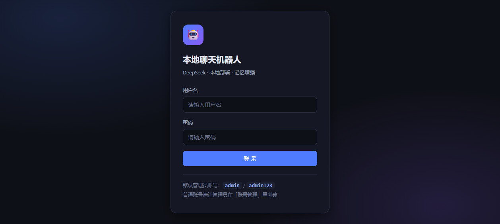
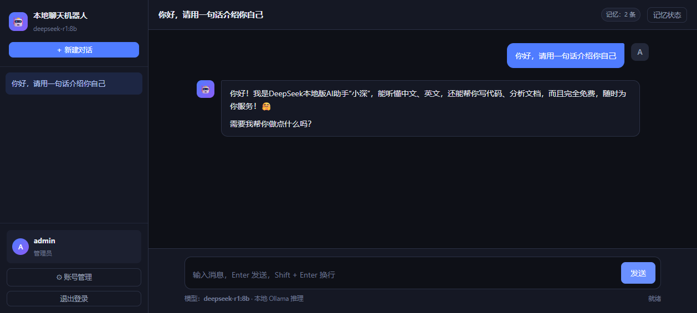
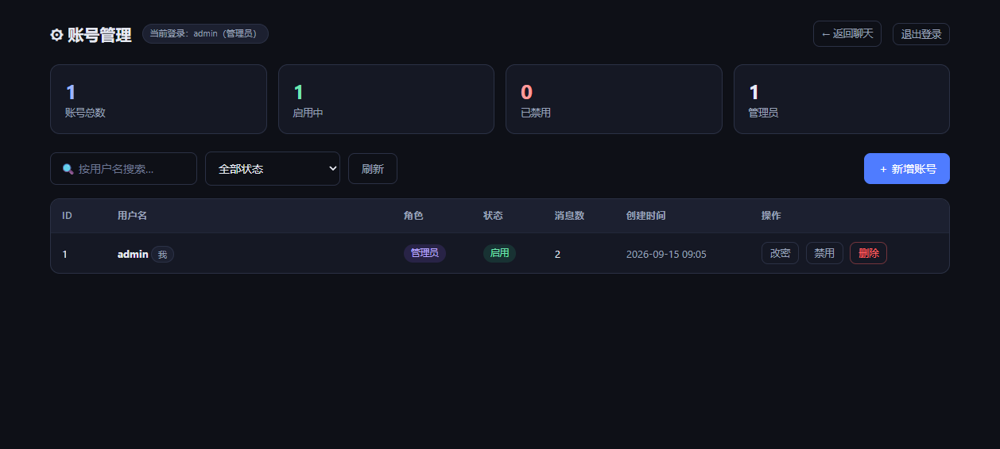

# 基于 DeepSeek 的本地聊天机器人

> 技术栈：**FastAPI + MySQL + LangChain + Ollama(deepseek-r1:8b) + 原生 HTML/CSS/JS**

从零搭一个**真正能用起来**的 AI 聊天系统：浏览器登录 → 和本地 DeepSeek 大模型对话 → 逐字打字机输出 → 记得你最近说过的话 → 聊再久也不会 token 爆炸 → 聊天记录永久保存在 MySQL。

大模型完全跑在本机，数据不出本地、无网络依赖、无 API 调用费用。

---

## 一、功能清单

| 模块 | 功能点 | 涉及技术 | 实现位置 |
|------|--------|----------|----------|
| 登录 | 用户名 + 密码登录；禁用账号不能登录 | MySQL、FastAPI、token | `backend/auth.py`、`frontend/login.html` |
| 账号管理 | 增加账号、修改密码/状态、删除账号、查询所有账号 | MySQL 增删改查、REST API | `backend/routers/users.py`、`frontend/admin.html` |
| 聊天 | 流式对话（打字机效果） | FastAPI `StreamingResponse`、fetch `ReadableStream` | `backend/routers/chat.py`、`frontend/chat.html` |
| 聊天 | 短期记忆（记得最近 10 轮） | LangChain `MessagesPlaceholder` | `backend/memory.py` |
| 聊天 | 防 token 爆炸（摘要/截断） | LLM 摘要压缩、滑动窗口 | `backend/memory.py`、`backend/llm.py` |
| 聊天 | 历史对话记录保存与回显 | MySQL `chat_history` 表 | `backend/routers/chat.py` |

---

## 二、技术架构

```
┌─────────────────────────────────────────────────┐
│  浏览器（前端）                                  │
│  login.html / admin.html / chat.html            │
│  HTML + CSS + JavaScript（原生，不用任何框架）   │
└──────────────────┬──────────────────────────────┘
                   │  HTTP + JSON（前后端通讯）
                   ▼
┌─────────────────────────────────────────────────┐
│  后端 FastAPI（Python）                          │
│  ├─ auth.py          登录认证（token）           │
│  ├─ routers/users.py 账号管理 CRUD               │
│  ├─ routers/chat.py  流式聊天 + 历史查询          │
│  ├─ memory.py        对话记忆（滑窗 + 摘要）★核心 │
│  └─ llm.py           大模型客户端                │
└────────┬────────────────────────┬───────────────┘
         │ pymysql（原生 SQL）     │ LangChain
         ▼                        ▼
┌──────────────────┐    ┌────────────────────────┐
│  MySQL           │    │  DeepSeek 大模型        │
│  users           │    │  （本机 Ollama 部署）   │
│  conversations   │    │  deepseek-r1:8b         │
│  chat_history    │    └────────────────────────┘
└──────────────────┘
```

---

## 三、界面预览

| 登录页 | 聊天页（流式对话） |
|:---:|:---:|
|  |  |

| 账号管理页 |
|:---:|:---:|
|  |

---

## 四、目录结构

```
deepseek-chatbot/
├── backend/                    # 后端（Python / FastAPI）
│   ├── main.py                 # 应用入口：路由注册 + 静态页挂载 + 启动自检
│   ├── config.py               # 全局配置（读 .env）
│   ├── db.py                   # MySQL 连接 + 原生 SQL 工具 + 建表
│   ├── auth.py                 # 密码哈希 + JWT(HS256) + 登录路由
│   ├── llm.py                  # Ollama 大模型客户端（流式 + 摘要）
│   ├── memory.py               # ★ 对话记忆：滑动窗口 + 摘要压缩
│   └── routers/
│       ├── users.py            # 账号管理 CRUD
│       └── chat.py             # 流式聊天 + 会话/历史查询
├── frontend/                   # 前端（原生三件套）
│   ├── login.html              # 登录页
│   ├── chat.html               # 聊天页（打字机效果）
│   ├── admin.html              # 账号管理页
│   ├── index.html              # 入口跳转
│   ├── README.md               # ★ 前端修改指南（改前端不用碰后端）
│   ├── css/app.css             # 全局样式（顶部 CSS 变量控制配色）
│   └── js/
│       ├── config.js           # ★ 前端唯一配置文件（后端地址 / 文案 / 主题色）
│       └── common.js           # 公共工具 + Markdown 渲染
├── docs/screenshots/           # 界面截图（README 里引用）
├── sql/init.sql                # 数据库初始化脚本
├── run.py                      # 一键启动脚本
├── tests/test_e2e.py           # 端到端自检（39 项断言）
├── requirements.txt            # Python 依赖
├── .env                        # 环境配置（含密码，不要提交）
└── .env.example                # 配置模板
```

---

## 五、前端可以独立修改（不影响后端）

前后端是**完全解耦**的：后端只提供 HTTP + JSON 接口，前端是纯静态文件。
改前端不会影响后端一行代码。

**最常改的几件事**，全都在 `frontend/js/config.js` 一个文件里：

```js
window.APP_CONFIG = {
    API_BASE: '',                    // 后端地址，留空=同源；填了就能前后端分开部署
    APP_NAME: '本地聊天机器人',        // 品牌名
    BOT_AVATAR: '🤖',                // AI 头像
    THEME: { accent: '#4f7cff' }     // 主题色
};
```

改完**刷新浏览器**即可，不用重启后端。想改得更彻底就直接编辑 HTML/CSS/JS。

完整说明（接口清单、SSE 事件格式、可复用的工具函数）见 `frontend/README.md`。

---

## 六、快速开始

### 0. 前置条件

| 依赖 | 版本要求 | 检查命令 |
|------|----------|----------|
| Python | 3.10+ | `python --version` |
| MySQL | 5.7 / 8.0+ | `mysql --version` |
| Ollama | 任意较新版本 | `ollama --version` |

### 1. 准备本地大模型

```bash
ollama pull deepseek-r1:8b      # 约 5.2 GB
ollama list                     # 确认模型已在列表里
```

> Ollama 服务需要保持运行（默认 `http://127.0.0.1:11434`）。
> 想换模型只改 `.env` 里的 `LLM_MODEL` 即可，代码不用动。

### 2. 创建虚拟环境并安装依赖

```bash
cd deepseek-chatbot
python -m venv .venv
.venv\Scripts\activate           # Windows
# source .venv/bin/activate      # macOS / Linux
pip install -r requirements.txt
```

### 3. 配置数据库连接

复制 `.env.example` 为 `.env`，改掉这几行：

```ini
DB_USER=root
DB_PASSWORD=你的MySQL密码
DB_NAME=deepseek_chat
LLM_MODEL=deepseek-r1:8b
```

> 数据库和表**不需要手动建**，服务启动时会自动创建；
> 也可以手动执行 `mysql -u root -p < sql/init.sql`。

### 4. 启动

```bash
python run.py
# 或： uvicorn main:app --app-dir backend --reload --port 8000
```

看到下面这样的输出就成功了：

```
============================================================
  基于 DeepSeek 的本地聊天机器人 —— 启动中
============================================================
[ok] 数据库已就绪（建库 / 建表 / 默认管理员）
[ok] Ollama 就绪，使用模型 deepseek-r1:8b
------------------------------------------------------------
  访问地址 : http://127.0.0.1:8000
============================================================
```

浏览器打开 <http://127.0.0.1:8000>

### 5. 默认账号

| 用户名 | 密码 | 角色 |
|--------|------|------|
| `admin` | `admin123` | 管理员 |

管理员登录后，左侧栏会出现「⚙ 账号管理」入口。

---

## 七、核心难点：对话记忆怎么做到「记得住」又「不爆炸」

对话越长，历史消息越多，全部塞给模型 → 超出上下文窗口 → 报错或变傻。这就是 **token 爆炸**。

本项目用 **滑动窗口 + 摘要压缩** 双策略解决（`backend/memory.py`）：

```
chat_history 全量历史（永久保存在 MySQL）
├───────────────────────────────┬──────────────────────────┐
│  已经被压缩的老消息             │  滑动窗口：最近 10 轮      │
│  → 压成一段 300 字摘要          │  → 原样送给模型            │
│  → 存进 conversations.summary  │                          │
└───────────────────────────────┴──────────────────────────┘
                    ↓
        实际送给模型的 = [系统提示词 + 历史摘要] + [最近 10 轮原始消息]
```

**触发时机**：每轮对话前检查，若「溢出滑动窗口的老消息」攒够 `COMPRESS_TRIGGER`（默认 10）条，
就调用大模型把它们和旧摘要合并成新摘要，并把 `summary_upto_id` 指针前移。

**几个关键点**：

- 摘要**不是丢弃**，而是「换一种更省 token 的形式保留」——所以 AI 仍然记得早期聊过的关键信息。
- 完整原文永远留在 `chat_history` 表里，前端回显时读全量，用户看到的记录一条不少。
- 摘要是**滚动合并**的（`已有摘要 + 新一批消息 → 新摘要`），不是每次重头再来。
- 用 `summary_upto_id` 指针而不是删除数据，所以「压缩到哪了」永远可追溯。

**怎么验证？** 在聊天页点右上角「记忆状态」，能看到：

| 指标 | 含义 |
|------|------|
| 历史消息总数 | `chat_history` 里这个会话的全部消息 |
| 窗口内（原样送模型） | 当前滑动窗口大小，最多 `SLIDING_WINDOW_ROUNDS × 2` 条 |
| 已压缩进摘要 | 已经被摘要吃掉的消息数 |
| 压缩触发阈值 | 攒够多少条溢出消息触发压缩 |

连续聊 15 轮以上，就能看到「已压缩」数字往上涨、摘要自动生成，而对话依然连贯。

### 相关配置（`.env`）

```ini
SLIDING_WINDOW_ROUNDS=10    # 短期记忆保留最近几轮
COMPRESS_TRIGGER=10         # 溢出消息攒够几条触发摘要压缩
MAX_SUMMARY_INPUT_CHARS=6000 # 喂给摘要模型的文本上限
SHOW_THINKING=true          # 是否展示 deepseek-r1 的思考链
```

---

## 八、接口一览

启动后可访问 <http://127.0.0.1:8000/docs> 看自动生成的交互式文档。

### 认证

| 方法 | 路径 | 说明 |
|------|------|------|
| POST | `/api/login` | 登录，返回 token |
| GET | `/api/me` | 当前账号信息 |
| POST | `/api/me/password` | 修改自己的密码 |

### 账号管理（管理员）

| 方法 | 路径 | 说明 |
|------|------|------|
| GET | `/api/users` | 查询所有账号（支持 `keyword` / `status` 筛选） |
| GET | `/api/users/stats` | 账号统计 |
| POST | `/api/users` | 新增账号 |
| PUT | `/api/users/{id}` | 修改密码 / 状态 / 角色 |
| DELETE | `/api/users/{id}` | 删除账号（级联删除其聊天记录） |

### 聊天

| 方法 | 路径 | 说明 |
|------|------|------|
| POST | `/api/chat/stream` | **流式对话**，SSE 逐字返回 |
| GET | `/api/conversations` | 我的会话列表 |
| POST | `/api/conversations` | 新建会话 |
| DELETE | `/api/conversations/{id}` | 删除会话 |
| GET | `/api/conversations/{id}/messages` | 历史消息回显 |
| GET | `/api/conversations/{id}/memory` | 查看记忆状态 |
| GET | `/api/health` | 健康检查（含模型就绪状态） |

### 流式对话的事件格式

`POST /api/chat/stream` 返回 `text/event-stream`，前端用 `fetch` + `ReadableStream` 逐块解析：

```
data: {"type":"meta","conversation_id":3,"user_message_id":41}
data: {"type":"thinking","content":"用户问的是……"}
data: {"type":"delta","content":"你"}
data: {"type":"delta","content":"好"}
data: {"type":"compressed","summary":"…","compressed_messages":10,…}
data: {"type":"done","conversation_id":3,"message_id":42,"memory":{…}}
```

| type | 含义 |
|------|------|
| `meta` | 会话 id、用户消息 id |
| `thinking` | 模型的思考链（deepseek-r1 特有，前端折叠展示） |
| `delta` | 正式回答的一个片段 → 拼起来就是打字机效果 |
| `compressed` | 本次触发了摘要压缩 |
| `error` | 模型调用出错 |
| `done` | 结束，附带最新记忆状态 |

---

## 九、数据库设计

```sql
users            -- 账号表
  id, username(唯一), password_hash(PBKDF2), status(1启用/0禁用), role, created_at, updated_at

conversations    -- 会话表（一个用户可开多个会话）
  id, user_id, title, summary(历史摘要), summary_upto_id(摘要覆盖到哪条), created_at, updated_at

chat_history     -- 聊天历史表
  id, user_id, conversation_id, role(user/assistant), content, created_at
```

**安全说明**：

- 密码用 **PBKDF2-HMAC-SHA256（20 万次迭代 + 随机盐）** 哈希后存储，数据库里看不到明文。
- token 是标准的 **JWT（HS256）**，手写实现（`backend/auth.py`），不依赖第三方库，方便看清结构。
- 每次请求都会重新查库校验账号状态，所以**管理员一禁用，该账号立刻掉线**，不用等 token 过期。

---

## 十、常见问题

**Q：启动时报「数据库初始化失败」？**
检查 `.env` 里的 `DB_USER` / `DB_PASSWORD`，确认 MySQL 服务已启动、密码正确。

**Q：报「Ollama 里没有找到模型」？**
执行 `ollama pull deepseek-r1:8b`。如果换过模型名，记得同步改 `.env` 的 `LLM_MODEL`。

**Q：回复很慢？**
8B 模型在纯 CPU 上推理确实慢，第一次调用还要加载模型（可能 10-30 秒）。有独显会快很多。
想更快可以换更小的模型，比如 `qwen2.5-coder:3b`。

**Q：为什么思考过程一直空着？**
`deepseek-r1` 是推理模型，思考链是否单独返回取决于 Ollama / LangChain 版本。
不管有没有思考链，正式回答都是正常流式输出的。可以在 `.env` 里把 `SHOW_THINKING` 设为 `false` 关掉它。

**Q：换模型要改哪些地方？**
只改 `.env` 里的 `LLM_MODEL`（和可选的 `SUMMARY_MODEL`），代码一行都不用动。

---

## 十一、设计取舍

开发过程中在几个地方做过权衡，记录一下当时的判断依据。

| 决策点 | 选择 | 理由 |
|--------|------|------|
| 数据库访问 | 原生 SQL，不用 ORM | 便于观察每条语句的执行细节，排查问题时更直接；本项目表结构简单，ORM 带来的收益有限 |
| 前端技术 | 原生 HTML/CSS/JS，零框架 | 页面交互复杂度不高，引入框架反而增加构建环节与体积 |
| 大模型 | 本地 Ollama，不用云端 API | 数据不出本地；无网络依赖，断网也能用；无调用费用 |
| 登录令牌 | 手写 HS256 JWT，不引第三方库 | 便于完整理解令牌的构造与校验过程；实现量很小 |
| 对话记忆 | 滑动窗口 + 摘要压缩 | 单纯截断会丢信息，单纯全量会超窗口，两者结合才能兼顾 |
